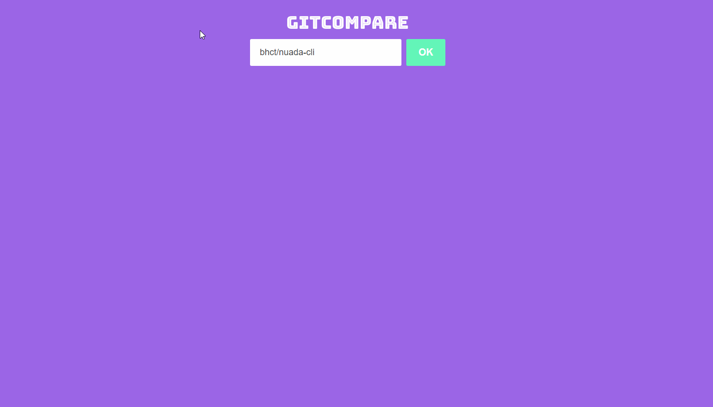

An project using ReactJS connected to github API.

## How can I run it?

Clone the project.
In the project directory, you can run:

### `npm install`

or

### `yarn install`

and than run:

### `npm start`

or

### `yarn start`

Than you will get this:

